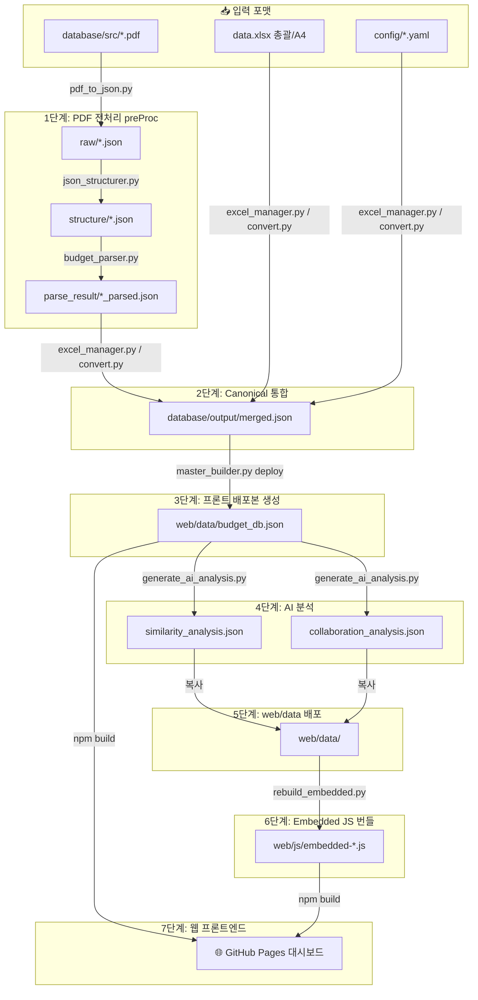

# 📊 BudgetN — 정부 예산 데이터 파이프라인 & 웹 대시보드

[](https://www.python.org/)
[](https://github.com/jsvine/pdfplumber)
[](https://scikit-learn.org/)
[](https://github.com/chamgil71/KAIB2026)
[](LICENSE)

> **PDF · XLSX · YAML → Canonical JSON → AI 분석 → 웹 대시보드 자동 배포**  
> 정부 예산 자료를 다양한 입력 포맷에서 받아 단일 canonical 데이터베이스(`merged.json`)로 통합하고, TF-IDF 기반 유사도·협업 분석을 거쳐 **반응형 웹 대시보드**로 자동 배포하는 7단계 데이터 파이프라인입니다.

---

## 📌 주요 특징 (Key Features)

* **📥 멀티 포맷 수집**: `PDF`, `XLSX(총괄/A4)`, `YAML`, `JSON` 등 어떤 입력 포맷이 들어와도 하나의 canonical schema(`merged.json`)로 수렴합니다.
* **🧠 AI 유사도·협업 분석**: TF-IDF + Cosine Similarity + Jaccard 기반으로 사업 간 유사도를 계산하고, 부처 간 협업 네트워크를 자동으로 도출합니다. LLM 확장 포인트가 내장되어 있습니다.
* **🏗️ 7단계 명확한 파이프라인**: PDF 파싱 → 통합 → 분석 → 배포까지 각 단계의 입·출력 파일이 명확히 분리됩니다. `master_builder.py` 한 줄로 전체를 실행하거나 단계별로 부분 실행이 가능합니다.
* **📦 Embedded JS Fallback**: 네트워크 없이도 동작할 수 있도록 핵심 JSON 데이터를 `embedded-*.js`로 번들링합니다. 정적 배포 환경에서도 모든 탭이 작동합니다.
* **🚀 자동 배포 (GitHub Pages)**: `main` 브랜치에 푸시하면 GitHub Actions가 Node.js 빌드 후 `web/dist`를 GitHub Pages에 자동 배포합니다.
* **⚙️ 설정 중심 운영**: `config/config.yaml`에서 컬럼 매핑·기준 연도·경로를 변경하면 코드 수정 없이 전체 파이프라인이 새 데이터 구조에 맞게 동작합니다.

---

## ⚙️ 시스템 아키텍처 (Architecture)

### 1. 7단계 파이프라인 데이터 흐름



### 2. 핵심 데이터 원칙

| 구분 | 파일 경로 | 역할 |
| :--- | :--- | :--- |
| **Internal Canonical** | `database/output/merged.json` | 모든 입력이 수렴하는 단일 진실 원천(Single Source of Truth) |
| **Frontend Master** | `web/data/budget_db.json` | 프론트엔드가 직접 읽는 배포본 (merged.json의 복사본) |
| **Sidecar 분석** | `web/data/*_analysis.json` | 유사도·협업 분석 결과 (필요한 탭에서만 fetch) |
| **Embedded Fallback** | `web/js/embedded-*.js` | 오프라인/정적 환경 fallback용 JS 번들 |

> 🔑 **원칙**: 프론트엔드는 원본 포맷(PDF, XLSX)을 직접 읽지 않습니다. `budget_db.json`과 sidecar 분석 파일만 읽습니다.

---

## 📂 디렉토리 구조 (Directory Structure)

```
KAIB2026/
├── .github/workflows/
│   └── deploy-pages.yml         # main 브랜치 push 시 GitHub Pages 자동 배포
├── config/                      # 중앙 설정 관리
│   ├── config.yaml              # 핵심: 컬럼 매핑, 기준연도, 경로 설정
│   ├── config_a4.yaml           # A4 XLSX Named Range 전용 설정
│   ├── config_export.yaml       # 엑셀 내보내기 스타일/컬럼 설정
│   ├── template.json            # canonical schema 참조용 템플릿
│   ├── pattern.yaml             # 데이터 정규화 패턴 규칙
│   └── path_config.py           # 경로 상수 파이썬 모듈
├── database/                    # 데이터 스테이징 디렉토리
│   ├── src/                     # ① 입력: 원본 PDF 파일
│   ├── raw/                     # ② 1차 파싱: *_raw.json
│   ├── structure/               # ③ 구조화: *_structured.json
│   ├── parse_result/            # ④ 최종 파싱: *_parsed.json
│   ├── output/                  # ⑤ Canonical 최종본: merged.json, analysis JSON
│   ├── input/                   # 임시 입력 스테이징
│   ├── logs/                    # 변환 실행 로그
│   └── backup/                  # 과거 스냅샷 백업
├── scripts/
│   ├── preProc/                 # 1단계: PDF → JSON 전처리 모듈
│   │   ├── main_cli.py          # CLI 진입점 (한 번에 모든 PDF 처리)
│   │   ├── pdf_to_json.py       # PDF 텍스트/테이블 추출
│   │   ├── json_structurer.py   # raw → structured 변환
│   │   ├── budget_parser.py     # structured → parsed 변환
│   │   └── json_manager.py      # parsed 병합 유틸리티
│   ├── pipeline/                # 2~6단계: 통합·빌드·배포 파이프라인
│   │   ├── master_builder.py    # ⭐ 마스터 진입점 (build / deploy / bundle)
│   │   ├── excel_manager.py     # XLSX ↔ merged.json 변환 진입점
│   │   ├── convert.py           # 총괄 XLSX → merged.json
│   │   ├── convert_a4.py        # A4 XLSX (Named Range) → merged.json
│   │   ├── export_xlsx.py       # merged.json → 총괄 요약 XLSX
│   │   ├── export_a4.py         # merged.json → A4 요약표 XLSX
│   │   ├── rebuild_embedded.py  # JSON → embedded-*.js 번들 생성
│   │   ├── update_metadata.py   # metadata 갱신
│   │   └── build_standalone.py  # 단일 파일 HTML 번들 생성
│   ├── analysis/
│   │   └── generate_ai_analysis.py  # AI 유사도·협업 분석 생성
│   ├── legacy_tools/            # 구버전 데이터 처리 도구 (참고용)
│   ├── refactor_tools/          # HTML/JS 리팩터링 일회성 유틸
│   └── utils/                   # 코드 일괄 치환 헬퍼
├── web/                         # 프론트엔드 (Node.js 빌드 → GitHub Pages)
│   ├── data/                    # 프론트 fetch 대상 JSON
│   ├── js/                      # JS 로직 및 embedded-*.js 번들
│   ├── css/                     # 스타일시트
│   ├── index.html               # 메인 대시보드
│   └── duplicate.html           # 중복·협업 분석 탭
├── docs/                        # 기술 문서
├── backend/                     # 백엔드 예약 디렉토리 (향후 확장용)
├── data.xlsx                    # 소규모 직접 입력용 XLSX
├── requirements.txt             # Python 의존성
├── GUIDE.md                     # 기술 상세 가이드 (스키마·템플릿 조건)
└── quick_guide.md               # 자주 쓰는 명령 빠른 참조
```

---

## ⚡ 빠른 시작 (Getting Started)

### 1. 패키지 설치

```bash
pip install -r requirements.txt
```

### 2. 입력 파일 준비

| 입력 유형 | 배치 경로 | 처리 스크립트 |
| :--- | :--- | :--- |
| 원본 PDF | `database/src/*.pdf` | `scripts/preProc/main_cli.py` |
| 총괄 XLSX | 루트 또는 지정 경로 | `scripts/pipeline/excel_manager.py` |
| A4 XLSX | 루트 또는 지정 경로 | `scripts/pipeline/excel_manager.py` |

### 3. 전체 파이프라인 실행 (권장)

```bash
# PDF가 있다면 먼저 전처리
python scripts/preProc/main_cli.py -i database/src -y

# XLSX → merged.json 통합
python scripts/pipeline/excel_manager.py import --type both

# 전체 빌드 (AI 분석 + 스냅샷)
python scripts/pipeline/master_builder.py build

# 웹 배포본 생성
python scripts/pipeline/master_builder.py deploy
```

### 4. 웹 프론트엔드 로컬 실행

```bash
cd web
npm install
npm run dev
# 브라우저에서 http://localhost:5173 접속
```

---

## 🔄 7단계 파이프라인 상세

### 1단계. PDF 전처리 (`scripts/preProc/`)

```bash
python scripts/preProc/main_cli.py -i database/src -y
```

| 입력 | 스크립트 | 산출물 |
| :--- | :--- | :--- |
| `database/src/*.pdf` | `pdf_to_json.py` | `database/raw/*_raw.json` |
| `database/raw/*.json` | `json_structurer.py` | `database/structure/*_structured.json` |
| `database/structure/*.json` | `budget_parser.py` | `database/parse_result/*_parsed.json` |

---

### 2단계. Canonical 통합 — `parsed / xlsx / yaml → merged.json`

```bash
# XLSX 템플릿 생성 (최초 1회)
python scripts/pipeline/excel_manager.py template

# 데이터 import (총괄 XLSX + A4 XLSX 동시)
python scripts/pipeline/excel_manager.py import --type both
```

**총괄 XLSX 필수 조건** (`config/config.yaml` 기준):

| 항목 | 규칙 |
| :--- | :--- |
| 필수 시트명 | `사업목록`, `내역사업`, `사업관리자`, `사업연혁`, `연도별예산` |
| 헤더 행 | 2행 |
| 데이터 시작 행 | 3행 |
| 필수 컬럼 | `사업코드`, `사업명`, `부처명`, 기준연도 예산 컬럼 |

> A4 XLSX는 Named Range 기반으로 `config/config_a4.yaml`을 따릅니다.

---

### 3단계. 배포본 생성 — `merged.json → budget_db.json`

```bash
python scripts/pipeline/master_builder.py deploy
```

`database/output/merged.json` → `web/data/budget_db.json` 복사.

---

### 4·5단계. AI 분석 및 배포 — `budget_db.json → analysis → web/data/`

```bash
python scripts/analysis/generate_ai_analysis.py
```

| 산출물 파일 | 내용 |
| :--- | :--- |
| `database/output/similarity_analysis.json` | TF-IDF 기반 사업 간 유사도 행렬 |
| `database/output/collaboration_analysis.json` | 부처 간 협업 네트워크 및 체인 |

이후 `master_builder.py deploy`가 `web/data/`로 자동 복사합니다.

---

### 6단계. Embedded JS 번들

```bash
python scripts/pipeline/rebuild_embedded.py
```

| 산출물 | 역할 |
| :--- | :--- |
| `web/js/embedded-data.js` | budget_db 핵심 데이터 번들 |
| `web/js/embedded-sim-v10-data.js` | 유사도 분석 번들 |
| `web/js/embedded-collab-data.js` | 협업 분석 번들 |
| `web/js/embedded-hybrid-data.js` | 하이브리드 분석 번들 |

---

### 7단계. 웹 프론트엔드 & 자동 배포

```bash
# 단일 번들 HTML 생성 (네트워크 없이 완전 동작하는 standalone)
python scripts/pipeline/master_builder.py bundle

# GitHub Pages 자동 배포: main 브랜치 push 시 자동 실행
git push origin main
```

---

## 📋 주요 스크립트 참조

### `master_builder.py` — 마스터 실행 진입점

| 명령어 | 동작 |
| :--- | :--- |
| `master_builder.py build` | XLSX import → AI 분석 → 스냅샷 생성 전체 빌드 |
| `master_builder.py deploy` | `merged.json` → `web/data/` 복사 + embedded JS 재생성 |
| `master_builder.py bundle` | 단일 standalone HTML 번들 생성 |

### `excel_manager.py` — XLSX ↔ JSON 변환

| 명령어 | 동작 |
| :--- | :--- |
| `excel_manager.py template` | 공식 총괄 XLSX 템플릿 파일 생성 (`template_project.xlsx`) |
| `excel_manager.py import --type both` | 총괄 + A4 XLSX → `merged.json` |
| `excel_manager.py export --type both` | `merged.json` → 총괄 + A4 XLSX |

### 보조 스크립트 폴더 현황

| 폴더 | 성격 | 사용 시점 |
| :--- | :--- | :--- |
| `scripts/legacy_tools/` | CSV↔JSON 변환, 부서 필터, GUI 데이터 조회 | 구버전 데이터 마이그레이션 시 |
| `scripts/refactor_tools/` | HTML 인라인 JS 분리, 대용량 라인 탐색 | 리팩터링 완료 후 보존용 |
| `scripts/utils/` | 연도 하드코딩 제거, config 병합, JSON 일괄 치환 | 연도 변경 시 재사용 가능 |

---

## 🚀 GitHub Actions 자동 배포

| 트리거 | 동작 | 대상 |
| :--- | :--- | :--- |
| `main` 브랜치 push | Node.js 빌드 → `web/dist` → GitHub Pages 배포 | `web/` 프론트엔드 |
| `workflow_dispatch` | 수동 재배포 | - |

> `concurrency: group: pages` 설정으로 동시 배포 충돌을 방지합니다.

---

## ⚠️ 현재 확인된 구조 이슈

| # | 이슈 | 영향 |
| :--- | :--- | :--- |
| 1 | `database/output/merged.json`이 항상 canonical final로 남는 흐름 미고정 | 빌드 재현성 불안정 |
| 2 | PDF parsed 결과를 `merged.json`으로 흡수하는 경로 미일관 | 1단계 산출물이 2단계에 자동 반영 안 됨 |
| 3 | 기존 배포 데이터에 `sub_projects[].budget_base` 누락 가능 | 예산 집계 오차 |
| 4 | `collaboration_analysis.json`이 프론트 기대 구조 미충족 | 협업 탭 일부 렌더링 실패 (`collaboration_chains`, `summary_statistics` 누락) |
| 5 | `config/template.json`이 실제 nested canonical 구조와 불일치 | 스키마 검증 우회 |

### 권장 다음 작업 (우선순위 순)

1. `merged.json`을 내부 canonical final로 강제하는 빌드 구조 고정
2. 기존 데이터셋 재빌드로 `sub_projects[].budget_base` 보정 반영
3. `collaboration_analysis.json` 구조를 프론트 기대값에 맞게 확장
4. `config/template.json`을 nested canonical schema 기준으로 재작성
5. 각 변환 함수별 단위 테스트 코드 작성

---

## 🔗 관련 상세 문서

* [📘 기술 가이드 (GUIDE.md)](GUIDE.md) — canonical schema 정의·XLSX 입력 조건·프론트 의존성 점검
* [⚡ 빠른 명령 참조 (quick_guide.md)](quick_guide.md) — 자주 쓰는 운영 명령 한눈에 정리
* [🏗️ 파이프라인 스크립트 구조](scripts/pipeline/PIPELINE_OVERVIEW.md) — `scripts/pipeline/` 폴더 상세 역할 및 연관관계
* [📝 개발 작업 로그 (work_logs.md)](docs/work_logs.md) — 스키마 정의·파이프라인 연결 검토 이력
* [📐 구현 계획 (implementation_plan.md)](docs/implementation_plan.md) — Phase별 구현 우선순위 및 완료 조건
