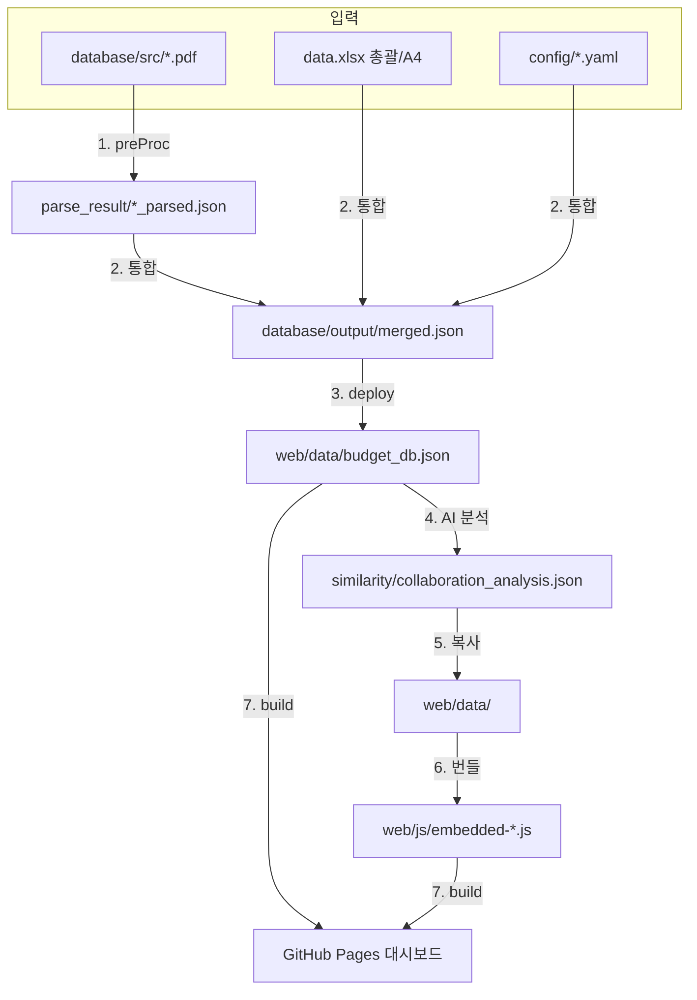

# BudgetN 아키텍처 (architecture.md)

> 정부 예산 데이터를 다양한 입력 포맷에서 받아 단일 canonical DB로 통합하고, AI 분석을 거쳐 웹 대시보드로 자동 배포하는 **7단계 파이프라인**의 구조 문서.
> 상위 SSOT: [`docs/spec.md`](./spec.md) · 운영 가이드: [`../GUIDE.md`](../GUIDE.md)

---

## 1. 아키텍처 개요

- **성격**: 백엔드 서버 없는 **정적 파이프라인 + 정적 웹**. Python이 로컬/CI에서 JSON을 생성하고, 프론트는 브라우저에서 그 JSON만 읽는다.
- **핵심 원칙(Single Source of Truth)**: 모든 입력(PDF·XLSX·YAML·JSON)은 **하나의 canonical DB `database/output/merged.json`** 으로 수렴한다. 프론트엔드는 원본 포맷을 절대 직접 읽지 않고 `web/data/budget_db.json`(merged.json 복사본)과 사이드카 분석 파일만 읽는다.

---

## 2. 7단계 데이터 흐름

| 단계 | 입력 → 출력 | 담당 |
| :-: | :--- | :--- |
| 1 | PDF → raw → structured → parsed JSON | `scripts/preProc/` |
| 2 | parsed·XLSX·YAML → `merged.json` (canonical) | `pipeline/excel_manager.py`·`convert*.py` |
| 3 | `merged.json` → `web/data/budget_db.json` | `master_builder.py deploy` |
| 4 | `budget_db.json` → 유사도·협업 분석 JSON | `analysis/generate_ai_analysis.py` |
| 5 | 분석 JSON → `web/data/` 복사 | `master_builder.py deploy` |
| 6 | JSON → `embedded-*.js` 오프라인 번들 | `pipeline/rebuild_embedded.py` |
| 7 | 프론트 빌드 → GitHub Pages 배포 | GitHub Actions `deploy-pages.yml` |

---

## 3. 레이어 구조

| 레이어 | 경로 | 역할 |
| :--- | :--- | :--- |
| **설정(Config)** | `config/` | 컬럼 매핑·기준연도·경로·정규화 패턴. 코드 수정 없이 데이터 구조 변경 흡수 |
| **데이터 스테이징** | `database/{src,raw,structure,parse_result,output}` | 단계별 입·출력 분리, `output/merged.json`이 최종 canonical |
| **파이프라인 엔진** | `scripts/{preProc,pipeline,analysis}` | 파싱·통합·분석·번들. `master_builder.py`가 마스터 진입점 |
| **프론트엔드** | `web/{data,js,css,*.html}` | `budget_db.json`+사이드카만 fetch, embedded-js fallback |
| **배포** | `.github/workflows/deploy-pages.yml` | main push → Node 빌드 → Pages (concurrency: pages) |

---

## 4. 핵심 데이터 계약

| 파일 | 위치 | 성격 |
| :--- | :--- | :--- |
| `merged.json` | `database/output/` | **내부 canonical final** (단일 진실 원천) |
| `budget_db.json` | `web/data/` | 프론트 마스터 (merged.json 복사본) |
| `*_analysis.json` | `web/data/` | 유사도·협업 사이드카 (탭별 선택 fetch) |
| `embedded-*.js` | `web/js/` | 오프라인/정적 fallback 번들 |

> 🔑 프론트는 PDF·XLSX를 직접 읽지 않는다. `budget_db.json` + 사이드카만.

---

## 5. 알려진 아키텍처 이슈 (회귀 롤백 대상)

| # | 이슈 | 영향 |
| :-: | :--- | :--- |
| 1 | `merged.json`을 canonical final로 강제하는 흐름 미고정 | 빌드 재현성 불안정 |
| 2 | PDF parsed → merged.json 흡수 경로 미일관 | 1단계 산출물이 2단계 자동 반영 안 됨 |
| 3 | `sub_projects[].budget_base` 누락 가능 | 예산 집계 오차 |
| 4 | `collaboration_analysis.json` 프론트 기대구조 미충족 | 협업 탭 일부 렌더 실패 |

> 상세·우선순위는 [`../README.md`](../README.md) 하단 "현재 확인된 구조 이슈" 참조.

---

*Created: 2026-07-09 (거버넌스 산출물 정비 — README 기반 아키텍처 정본화)*
